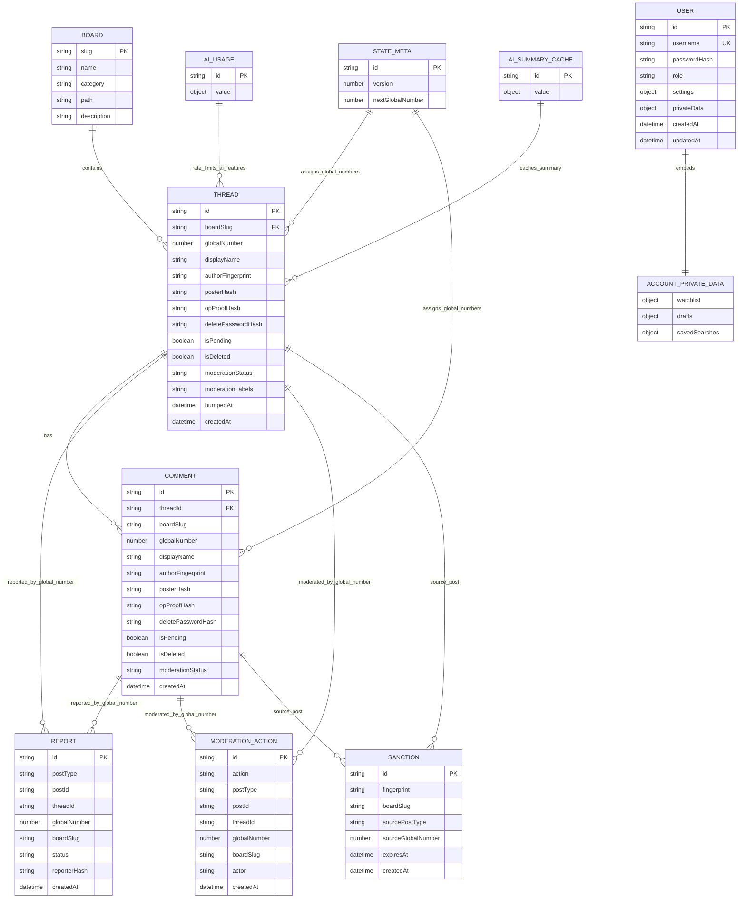
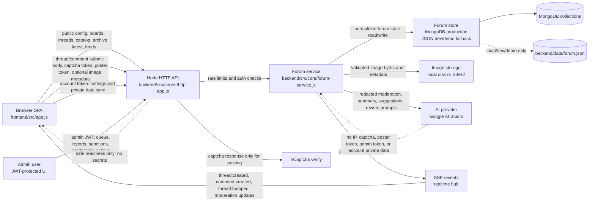
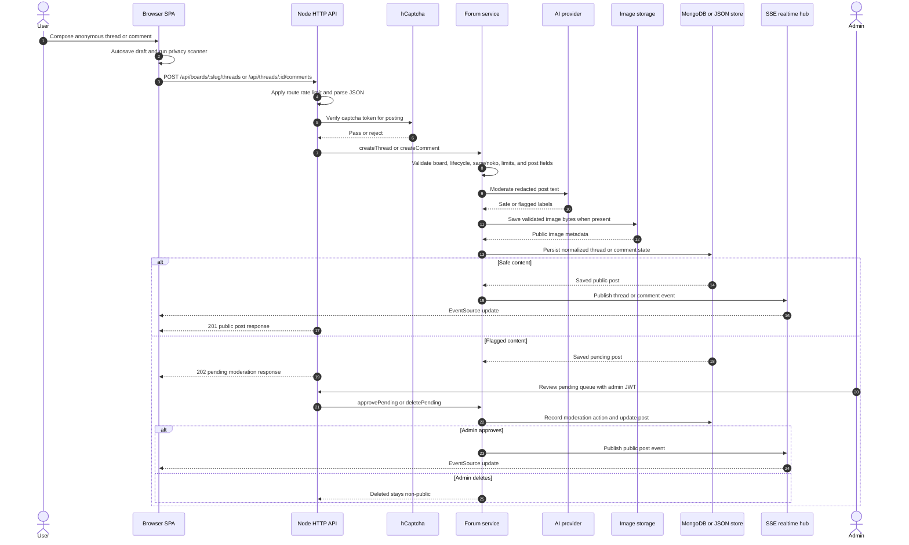

# 36chan

Node.js + Vite for fullstack

Features:
- Anonymous public boards
- Realtime updates
- Admin JWT moderation
- AI pre-publish moderation
- AI summary
- AI reply suggestions.
- Local disk image storage for development.

The app is split into:

- `backend/`: Node API, persistence, moderation, admin routes, and static serving.
- `frontend/`: Vite-hosted browser UI.

## Run

```bash
npm test
npm run dev
```

```bash
npm run dev:backend
npm run dev:frontend
```

Browser smoke verification runs the built frontend against a temporary backend store and Chrome headless:

```bash
npm run build
npm run test:e2e
```

Use the full release gate before deployment:

```bash
npm run release:verify
```

CI runs the same release verification through `.github/workflows/ci.yml`.

For account, anonymous posting, passkey, 2FA, and admin security rules, see `docs/account-security.md`.

## Configuration

Copy `backend/.env.example` to `backend/.env` for local backend settings.

Important runtime values:

- `STORE_DRIVER`: `mongo` is required for production.
- `MONGODB_URI`: required when `STORE_DRIVER=mongo`.
- `ADMIN_USERNAME`, `ADMIN_PASSWORD`, `JWT_SECRET`: enable admin login.
- `MODERATION_FINGERPRINT_SECRET`: secret used to hash poster/IP fingerprints for temporary cooldown/ban enforcement.
- `POSTER_PROOF_SECRET`: secret used to recognize OP follow-up replies from the same local poster token without exposing the token.
- `HCAPTCHA_SITE_KEY`, `HCAPTCHA_SECRET`: enable hCaptcha on public posting. In production, posting fails unless `HCAPTCHA_SECRET` is configured.
- `GOOGLE_AI_API_KEY`, `GOOGLE_AI_MODEL`: enable AI summary/suggestions and provider-backed moderation.
- `MAX_IMAGE_BYTES`: upload payload limit.
- `IMAGE_STORAGE_DRIVER`: `local` by default, or `s3` for S3-compatible object storage.
- `UPLOAD_ROOT`: local disk folder for uploaded images, served as `/uploads/*` when `IMAGE_STORAGE_DRIVER=local`.
- `S3_ENDPOINT`, `S3_REGION`, `S3_BUCKET`, `S3_ACCESS_KEY_ID`, `S3_SECRET_ACCESS_KEY`: required when `IMAGE_STORAGE_DRIVER=s3`.
- `S3_PUBLIC_BASE_URL`, `S3_KEY_PREFIX`: optional public CDN/base URL and object key prefix for S3-compatible storage.
- `STATIC_ROOT`: optional override for backend static file serving.

MongoDB is the production persistence store. Mongo storage uses Mongoose models for boards, threads, comments, users, reports, moderation logs, sanctions, AI usage, summary cache, and global state metadata.

```bash
STORE_DRIVER=mongo
MONGODB_URI=mongodb://127.0.0.1:27017/36chan
```

For production readiness and Docker/deployment health checks, `GET /api/health` reports app status, store readiness, image storage readiness, AI provider configured state, hCaptcha configured state, safe counts, and model readiness without returning `MONGODB_URI`, admin credentials, API keys, hCaptcha secrets, storage endpoints, or other secret/raw environment values.

### MongoDB Database Structure

`backend/src/core/mongo-store.js` maps the normalized forum state into these production collections:

| Collection | Purpose | Main keys and indexes |
|---|---|---|
| `boards` | Fixed public board catalog seeded from backend config. | Unique `slug`. |
| `threads` | Original posts, thread lifecycle state, moderation state, poll/image metadata, OP proof fields, and public sorting timestamps. | Unique `id`; `{ boardSlug, bumpedAt }`; `globalNumber`. |
| `comments` | Replies attached to threads with the same public post, moderation, image, OP proof, and delete-password fields used by threads. | Unique `id`; `{ threadId, globalNumber }`; `globalNumber`. |
| `users` | Optional accounts for synced settings and private data. Accounts do not replace anonymous posting by default. | Unique sparse `username`; `{ role, createdAt }`. |
| `reports` | User reports against thread/comment global numbers and admin report workflow status. | `createdAt`; `{ status, boardSlug }`. |
| `moderationActions` | Audit trail for AI/admin decisions, approve/delete reasons, sanctions, and queue history. | `createdAt`; `postId`. |
| `sanctions` | Temporary cooldown/ban records keyed by hashed posting fingerprint. | `{ fingerprint, expiresAt }`; `createdAt`. |
| `aiUsage` | Key/value counters for daily AI budget guards. | `_id` key. |
| `aiSummaryCache` | Key/value cache for generated thread summaries. | `_id` key. |
| `stateMeta` | Global metadata such as schema `version` and `nextGlobalNumber`. | `_id` key, currently `global`. |

The Mongo store reads collections into the same normalized state shape used by the JSON fallback (`users`, `threads`, `comments`, `moderationActions`, `reports`, `sanctions`, `aiUsage`, `aiSummaryCache`, and `nextGlobalNumber`). Writes currently normalize the full state and replace the mutable collections in a serialized queue, which keeps JSON and Mongo behavior aligned for the current single-process service design.

Use placeholders in documentation and environment examples:

```bash
STORE_DRIVER=mongo
MONGODB_URI=mongodb://127.0.0.1:27017/36chan
```

Never commit a production `MONGODB_URI`, admin credential, JWT secret, AI key, S3 key, or hCaptcha secret. `/api/health` exposes only safe readiness fields and counts for deployment monitors.

## Docker

Create a local compose env file, replace every placeholder secret, then build and run the production-like stack with MongoDB:

```bash
cp compose.env.example .env
docker compose up --build
```

The compose stack serves the built Vite frontend and backend on `http://localhost:3000`, uses MongoDB via `STORE_DRIVER=mongo`, and stores local uploads in the `uploads` Docker volume.

`docker-compose.yml` fails fast when required production secrets are missing. For config validation without committing secrets, run:

```bash
docker compose --env-file compose.env.example config --quiet
```

Set real secrets through your shell or the ignored local compose `.env` before running a deploy-like environment:

```bash
ADMIN_USERNAME=admin
ADMIN_PASSWORD=replace-with-long-password
JWT_SECRET=replace-with-long-random-secret
MODERATION_FINGERPRINT_SECRET=replace-with-long-random-secret
POSTER_PROOF_SECRET=replace-with-long-random-secret
HCAPTCHA_SITE_KEY=10000000-ffff-ffff-ffff-000000000001
HCAPTCHA_SECRET=replace-with-hcaptcha-secret
STORE_DRIVER=mongo
MONGODB_URI=mongodb://mongo:27017/36chan
```

Configure `HCAPTCHA_SITE_KEY` and `HCAPTCHA_SECRET` before using the compose stack as a real public deployment. Use `npm run dev` for local no-secret development.

## Docker

Build and run the production-like stack with MongoDB:

```bash
docker compose up --build
```

The compose stack serves the built Vite frontend and backend on `http://localhost:3000`, uses MongoDB via `STORE_DRIVER=mongo`, and stores local uploads in the `uploads` Docker volume.

Set real secrets through your shell or a local compose `.env` before running a deploy-like environment:

```bash
ADMIN_USERNAME=admin
ADMIN_PASSWORD=replace-with-long-password
JWT_SECRET=replace-with-long-random-secret
MODERATION_FINGERPRINT_SECRET=replace-with-long-random-secret
POSTER_PROOF_SECRET=replace-with-long-random-secret
HCAPTCHA_SITE_KEY=10000000-ffff-ffff-ffff-000000000001
HCAPTCHA_SECRET=replace-with-hcaptcha-secret
STORE_DRIVER=mongo
MONGODB_URI=mongodb://mongo:27017/36chan
```

If `NODE_ENV=production` and `HCAPTCHA_SECRET` is empty, thread/comment posting is blocked by design. Use `npm run dev` for local no-secret development.

For S3-compatible image storage:

```bash
IMAGE_STORAGE_DRIVER=s3
S3_ENDPOINT=https://account-id.r2.cloudflarestorage.com
S3_REGION=auto
S3_BUCKET=36chan
S3_ACCESS_KEY_ID=...
S3_SECRET_ACCESS_KEY=...
S3_PUBLIC_BASE_URL=https://cdn.example.com/36chan
S3_KEY_PREFIX=uploads
```

The backend uses path-style signed `PUT` requests, which works for common S3-compatible services such as MinIO and Cloudflare R2.

## Architecture Diagrams

### Entity Relationship Diagram



The public post identity is intentionally anonymous-first: `displayName` is a per-post label, while account `username` stays in `User` and is not exposed as the public author by default. Account watchlist, drafts, and saved searches are embedded in `User.privateData`; local/dev JSON storage mirrors the same normalized state shape, while MongoDB is the production store.

### Activity Diagram


Public reading and anonymous posting do not require an account. Accounts only add opt-in cross-device private data and settings sync; public posts remain `Anonymous` unless a per-post `displayName` is explicitly entered.

### Data Flow Diagram



Trust boundaries are explicit: public responses and `/api/health` return readiness and counts without secret values; AI calls receive redacted draft/content text; account/admin JWTs stay in request authorization headers and are not written to public post records.

### Posting Sequence Diagram



Pending and deleted posts are stored for moderation history but are not emitted as public SSE content. Logged-in accounts can sync private data around this flow, but account identity is not copied into the public author field by default.
